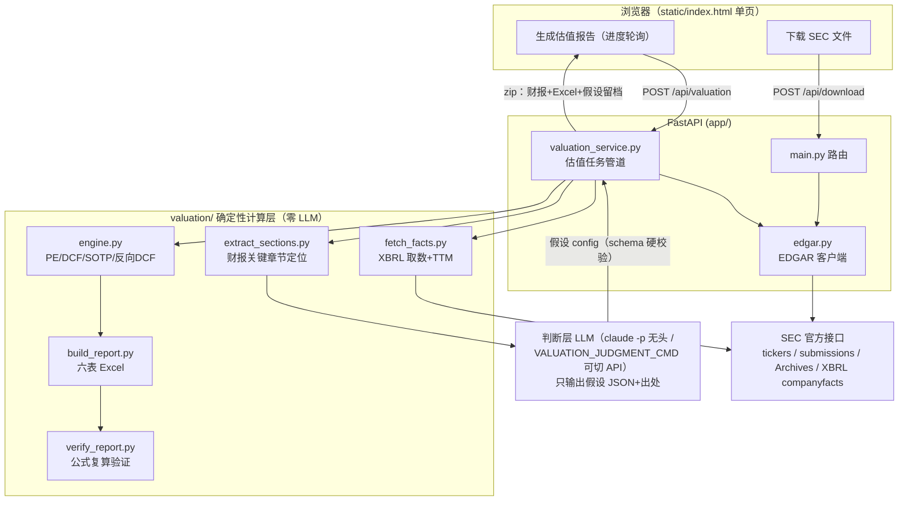

# 📊 EDGAR 财报下载器 (sec-filing-downloader)

输入美股股票代码，自动从 **SEC EDGAR 官方数据库** 查找并批量下载财报文件（10-K / 10-Q / 20-F / 6-K），
按 `代码_表单_报告期` 统一重命名后打包成 zip，作为后续 DCF / PE 估值分析的数据底座。

> 第一阶段目标：**搜索 → 下载 → 重命名**。财务数据提取与估值模型见 [TODO.md](TODO.md)。

## ✨ 功能

- 🔍 **代码查询**：ticker → CIK 自动映射（SEC 全量 1 万+ 上市主体，每日缓存）
- 🏢 **公司信息卡**：公司名、交易所、最新年报/季报日期
- 📥 **批量下载**：任选季报（10-Q / 6-K）、年报（10-K / 20-F），支持中概股等外国发行人
- 📌 **快捷模式（默认）**：「最新一份 / 最新两份」——每种选中类型各取最新 N 份；估值场景通常这就够了（一份 10-K 自带 3 年利润表对比）
- 🗓️ **自定义范围**：按「季度 + 年份」起止筛选（按报告期 reportDate 过滤），可勾选"到最新"，用于拉长期历史
- 🏷️ **自动重命名**：`NVDA_10-K_2025-01-26.htm` 这样的可排序文件名，重名自动去重
- 📦 **打包下载**：zip 内附 `manifest.csv`（表单、报告期、提交日、原始 URL 溯源）
- ✅ **SEC 合规**：User-Agent 携带联系邮箱；请求间隔 0.12s（限速 10 req/s 之内）
- 📊 **一键估值报告**：输入代码 → bear/base/bull 三情景 Excel（PE 法 + 十年 FCFF DCF + SOTP +
  反向 DCF + 敏感性），**AI 只定假设并注明财报出处，数字全部由确定性引擎计算并经公式复算验证**

## 🏗️ 架构



**下载数据流**：ticker → `company_tickers.json` 查 CIK → `submissions/CIK##########.json` 拿提交记录
（超出最近 1000 条自动拉分页）→ 按表单类型 + 报告期过滤（6-K 智能挑选 + 自动带 EX-99 附件）→
统一重命名 → zip 返回。全程无数据库，只依赖 SEC 公开接口。

**估值三层分工**（防幻觉的核心设计）：
1. **数据层**（零 LLM）：XBRL companyfacts 结构化取数——多标签合并、Q4 推导、
   TTM（损益=四季加总；现金流=年度+YTD差额）
2. **判断层**（LLM，唯一的 AI 环节）：读代码定位好的财报章节摘录，只输出假设 config
   （增速/利润率/倍数/WACC/FCF路径 + 每条依据与出处）；服务器注入价格/股本等事实并做
   schema 硬校验，不合格自动重试——**LLM 永远不碰算术**
3. **计算层**（确定性 Python）：引擎算出全部数字 → Excel 里所有结果是引用黄色假设格的活公式 →
   `formulas` 包独立复算 16 个关键单元格与引擎交叉核对，全部一致才交付

## 📁 目录结构

```
sec-filing-downloader/
├── app/
│   ├── main.py                # FastAPI 入口：/api/company、/api/download、静态托管
│   ├── edgar.py               # SEC EDGAR 客户端：查询、过滤、下载、重命名、打包
│   └── valuation_service.py   # 估值任务管道：/api/valuation 提交/轮询/下载
├── static/
│   └── index.html             # 深色主题单页前端（原生 JS，无构建步骤）
├── valuation/                 # 估值确定性计算层 + 判断层提示词
│   ├── fetch_facts.py         # XBRL companyfacts 取数（多标签合并/Q4推导/TTM）
│   ├── extract_sections.py    # 财报关键章节定位（分部/税率/capex/流动性）
│   ├── judgment_prompt.md     # 判断层提示词（假设 schema + 检查清单）
│   ├── engine.py              # PE 法 / 十年 FCFF DCF / SOTP / 反向 DCF / 敏感性
│   ├── build_report.py        # 六表 Excel（假设=黄色活格，全表公式联动）
│   ├── verify_report.py       # formulas 包独立复算，16 项交叉核对
│   └── README.md              # 流水线用法与 config schema
├── jobs/                      # 估值任务工作目录（gitignore）
├── reports/                   # 手动生成的报告（gitignore）
├── requirements.txt
├── README.md
└── TODO.md                    # 路线图
```

## 🚀 快速开始（Windows）

```powershell
git clone https://github.com/chrisudf/sec-filing-downloader.git
cd sec-filing-downloader
python -m venv .venv
.venv\Scripts\pip install -r requirements.txt
# SEC 合规：配置联系邮箱（二选一）
$env:SEC_EMAIL = "you@example.com"          # 环境变量
"you@example.com" | Out-File .sec_email     # 或项目根目录文件（已 gitignore）
.venv\Scripts\python -m uvicorn app.main:app --port 8756
# 打开 http://127.0.0.1:8756
```

## 🔌 API

### `GET /api/company/{ticker}`

```json
{
  "ticker": "NVDA",
  "cik": 1045810,
  "name": "NVIDIA CORP",
  "exchanges": ["Nasdaq"],
  "fiscalYearEnd": "0126",
  "latest": { "10-K": { "filingDate": "...", "reportDate": "..." }, "10-Q": { "..." : "..." } }
}
```

### `POST /api/download`

```json
{
  "ticker": "NVDA",
  "report_types": ["quarterly", "annual"],
  "mode": "latest",
  "latest_count": 1,
  "start_year": 2023, "start_quarter": 1,
  "to_latest": true,
  "end_year": null, "end_quarter": null
}
```

`mode: "latest"`（默认）时每种类型各取最新 `latest_count` 份，忽略时间范围字段；
`mode: "range"` 时按 `start_*` / `end_*` / `to_latest` 的季度区间过滤。

返回 `application/zip`（响应头 `X-File-Count` 为文件数），zip 内含重命名后的财报 + `manifest.csv`。

### `POST /api/valuation` → `{job_id}`

`{"ticker": "NVDA"}` 提交估值任务（单并发）。
判断层默认走本机 Claude Code（`claude -p`，需先 `claude /login`；路径可用 `CLAUDE_CLI_PATH` 覆盖，
整个判断层命令可用 `VALUATION_JUDGMENT_CMD` 替换成任何"stdin 进 prompt、stdout 出 JSON"的程序）。

### `GET /api/valuation/{job_id}` / `GET /api/valuation/{job_id}/result`

轮询进度（九个步骤逐步显示）；完成后下载 zip（财报原件 + manifest + 估值 Excel + 假设留档 config.json）。

## ⚠️ SEC 使用注意

- SEC 要求所有自动化请求的 **User-Agent 包含真实联系方式**——通过环境变量 `SEC_EMAIL` 或项目根目录
  `.sec_email` 文件配置（服务端统一使用，页面无需填写），不配置会返回明确报错，乱填可能被 SEC 403
- 限速 **10 请求/秒**，本项目单线程顺序下载并留 0.12s 间隔，请勿改成高并发
- 单次打包上限 60 个文件，防止误选超大范围拖垮下载

## 📄 License

MIT
