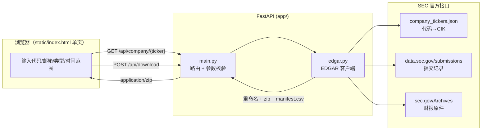

# 📊 EDGAR 财报下载器 (sec-filing-downloader)

输入美股股票代码，自动从 **SEC EDGAR 官方数据库** 查找并批量下载财报文件（10-K / 10-Q / 20-F / 6-K），
按 `代码_表单_报告期` 统一重命名后打包成 zip，作为后续 DCF / PE 估值分析的数据底座。

> 第一阶段目标：**搜索 → 下载 → 重命名**。财务数据提取与估值模型见 [TODO.md](TODO.md)。

## ✨ 功能

- 🔍 **代码查询**：ticker → CIK 自动映射（SEC 全量 1 万+ 上市主体，每日缓存）
- 🏢 **公司信息卡**：公司名、交易所、官网、投资者网站、最新年报/季报日期
- 📥 **批量下载**：任选季报（10-Q / 6-K）、年报（10-K / 20-F），支持中概股等外国发行人
- 📌 **快捷模式（默认）**：「最新一份 / 最新两份」——每种选中类型各取最新 N 份；估值场景通常这就够了（一份 10-K 自带 3 年利润表对比）
- 🗓️ **自定义范围**：按「季度 + 年份」起止筛选（按报告期 reportDate 过滤），可勾选"到最新"，用于拉长期历史
- 🏷️ **自动重命名**：`NVDA_10-K_2025-01-26.htm` 这样的可排序文件名，重名自动去重
- 📦 **打包下载**：zip 内附 `manifest.csv`（表单、报告期、提交日、原始 URL 溯源）
- ✅ **SEC 合规**：User-Agent 携带联系邮箱；请求间隔 0.12s（限速 10 req/s 之内）

## 🏗️ 架构



**数据流**：ticker → `company_tickers.json` 查 CIK → `submissions/CIK##########.json` 拿全部提交记录
（超出最近 1000 条时自动拉分页）→ 按表单类型 + 报告期过滤 → 逐个下载 primaryDocument →
统一重命名 → 内存中打 zip 返回。全程无数据库、无 API key，只依赖 SEC 公开接口。

## 📁 目录结构

```
sec-filing-downloader/
├── app/
│   ├── main.py        # FastAPI 入口：/api/company、/api/download、静态托管
│   └── edgar.py       # SEC EDGAR 客户端：查询、过滤、下载、重命名、打包
├── static/
│   └── index.html     # 深色主题单页前端（原生 JS，无构建步骤）
├── requirements.txt
├── README.md
└── TODO.md            # 路线图
```

## 🚀 快速开始（Windows）

```powershell
git clone https://github.com/chrisudf/sec-filing-downloader.git
cd sec-filing-downloader
python -m venv .venv
.venv\Scripts\pip install -r requirements.txt
.venv\Scripts\python -m uvicorn app.main:app --port 8756
# 打开 http://127.0.0.1:8756
```

## 🔌 API

### `GET /api/company/{ticker}?email=you@example.com`

```json
{
  "ticker": "NVDA",
  "cik": 1045810,
  "name": "NVIDIA CORP",
  "exchanges": ["Nasdaq"],
  "website": "https://www.nvidia.com",
  "investorWebsite": "https://investor.nvidia.com",
  "fiscalYearEnd": "0126",
  "latest": { "10-K": { "filingDate": "...", "reportDate": "..." }, "10-Q": { "..." : "..." } }
}
```

### `POST /api/download`

```json
{
  "ticker": "NVDA",
  "email": "you@example.com",
  "report_types": ["quarterly", "annual"],
  "mode": "latest",
  "latest_count": 1,
  "start_year": 2023, "start_quarter": 1,
  "to_latest": true,
  "end_year": null, "end_quarter": null
}
```

`mode: "latest"`（默认）时每种类型各取最新 `latest_count` 份，忽略时间范围字段；
`mode: "range"` 时按 `start_*` / `end_*` / `to_latest` 的季度区间过滤。

返回 `application/zip`（响应头 `X-File-Count` 为文件数），zip 内含重命名后的财报 + `manifest.csv`。

## ⚠️ SEC 使用注意

- SEC 要求所有自动化请求的 **User-Agent 包含真实联系方式**（本项目放的是页面里填的邮箱），不填或乱填可能被 403
- 限速 **10 请求/秒**，本项目单线程顺序下载并留 0.12s 间隔，请勿改成高并发
- 单次打包上限 60 个文件，防止误选超大范围拖垮下载

## 📄 License

MIT
